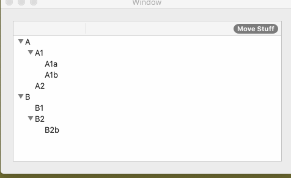

# OutlineViewDiffableDataSource
Cocoa NSOutlineView version of diffable data sources in iOS 13

### Usage

Initialize a data source and send it its own `NSOutlineViewDataSource` and `NSOutlineViewDelegate` to pass through the calls.

When you call `applySnapshot()` on the diffable data source instead of `reloadData()`, it appropriately animates all the cells to their new locations.

### To Do

- Perhaps honor the `responds(to: selector)` stuff in the data source. I began this, but it wasn't necessary, so I punted.
- Passthrough implementations of all the remaining delegate methods
